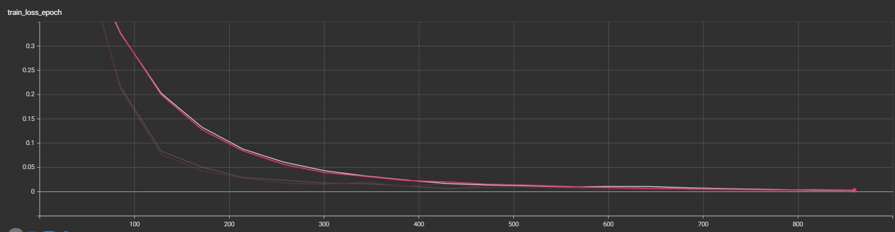
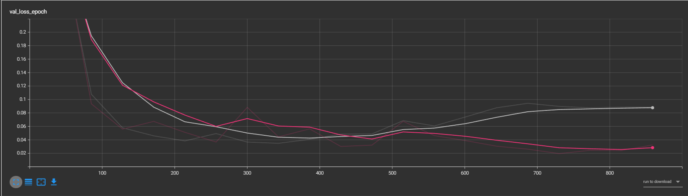
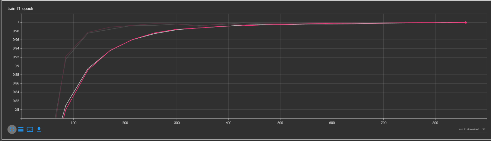
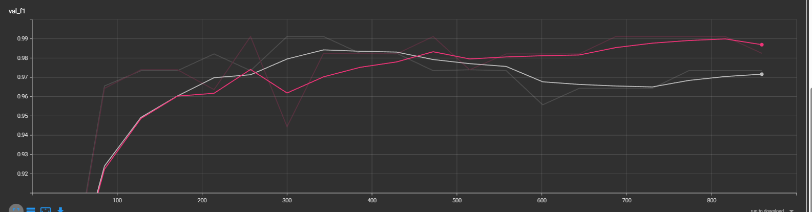
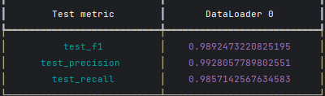

# Translated-ML-assignment

## Exercise 1:

### Data Analysis
The objective of this exercise is to create a binary classifier for the Italian language. I started by understanding and analyzing the data. *The notebook EDA* contains a detailed analysis of the dataset and my conclusions.
I, then, created a balanced training (500 italian and 800 non-italian) and testing (140 Italian and 200 non-Italian ) dataset. 


### Modeling
For the model choice I had the following ideas:

- Use a tf-idf algorithm based on my training, to generate a tf-idf matrix, which will be used to fit a classifier algorithm such as logistic regression, SVM, Random forrest..
- Generate embeddings using BERT and then train the classifier
- Train a BERT model on the dataset from scratch.


As all AI projects, a trade-off is always present, in this case it's a trade-off between good results and computational power. The first approach would be the fastest, since it uses a tf-idf algorithm to vectorize the input, and a simple classifier to predict the result. However, it would be unable to make good predictions on any new data that wasn't present in the training corpus.
The second approach, would perform well and fast since we're only using the embedding layer of BERT but might sturggle on mixed text. The third option, which was ultimately chosen, provides the best performance since it captures specific information from the training set and can be optimized for speed by using a lighter version of BERT. Furthermore, since the data contains both Italian and mixed text, using a language-specific model like the first and second options may not perform well on the mixed text. 
BERT, on the other hand, can handle multiple languages and is trained on a large corpus of diverse text, making it suitable for this task. 

As a conclusion to this step, I trained a BERT tiny variation on the dataset. The data, that is preprocessed (from the EDA step),
is tokenized using BERT Tokenizer. My hypothesis was the model could capture the class of the sentence,even, if it's short. To confirm this I trained 2 variations of the model, one using a sequence max length of 128 and other with 512.

### Results

Note: the grey color corresponds to the model (A) with 128 seq len and the pink (B) for 512 seq len.



The loss function in our case is Binary Cross-Entropy. The 2 plots shows that the training was successful and the losses are converging. I save the best model based on the val-loss, the best version of model A would be the one at epoch 8.

for the evaluation metrics, I calculated the f1-score:



Once again, we see that the plots are converging. It's also confirms that model(A), is over-fitting since the validation f1-score peaks at epoch 8.

Finally, I calculated the f1-score, precision and recall and the test set:

**Model A**




The results are quite similar, so it makes sense to use the model with the 128 sequence, to save time and resources.
*Note:* I made a fortunate mistake, I initially used  bert-base tokenizer which works on the english language and not the multli-lingual one. The results shown on the above section demonstrate that using bert-base tokenizer on the italian language performed well.

### Deployment

For the deployment I used fastapi, to wrap the model inside an API endpoint and exposed it on port 5000. This web app can be deployed on an EC2 machine. To ensure the reproducibility of the application on different environments, I containerized it inside a docker container.
to build the image

```docker build . -t [image_tag_name]```

to run the image:

```docker run --publish 5000:5000 ```


**To run it without docker**
````commandline
pip install -r requirements.txt
python app.py
````


## Exercise 2:

1- To implement the Machine Translation System, I will use a Neural Machine Translation model. such models are based on 
an encoder-decoder architecture, the encoder maps the input to a hidden representation. The decoder generates the output
based on this representation. **Transformers** achieve SOTA results, they are based on self-attention mechanism, 
that is able to withdraw relationship between tokens inside a sequence, much faster. The attention mechanism is based on
mat-mul operations, so it can be parallelized. However, it's a double-edged sword, mat-mul scales quadratically with the
sequence length, which make it hard to train on lengthier sequences. the main features of such a model are:

- Ability to handle variable length-sequences, either by padding the short ones or truncating the long one.
- Ability to learn the contextual meaning of words
- Ability to focus on the most important words in the sequence (via the attention mechanism)

For the entire system, it's composed of:
- preprocessing module: to remove noise, punctuation, lemmatize and tokenize the sequence
- Language Identification module: to identify the sequence source
- Translation model
- Postprocessing: reformulate the outpout of the translation model in a human-friendly output

it should be scalable to meet multiple users needs

2- To handle different customer needs, I would create different versions of my model with different tradeoff between 
performance and speed. For customers, who prioritize the quality of results, I would use large models, with deeper layers
and more parameters, and larger embeddings to vectorize the tokens. this will result in lengthier training, larger 
computational power, but it's guaranteed to output higher-quality results. In practical case, I will use a BERT model 
with a large number of transformer layers and multi-head attentions. For the other clients, I will use smaller models with
fewer parameters, shallower layers and smaller embeddings to ensure a faster execution time. We still can make use of 
the larger model via knowledge distillation to transfer the knowledge to the smaller model.

3- To monitor the performance of Machine Translation System, after deployment. I would resort to 2 approaches:

- Automatic testing: Comparing the results of the model with existing translation, by calculating metrics such as BLEU,
METEOR or TER, to evaluate the similarity between them. These set of tests, would run periodically to measure the shift 
of the performance of the model, based on new data. This component would be critical for a continuous learning approach,
if the model performance falls lower than a threshold (let's say 0.9) we retrain the model by combining the intitial dataset 
with a newly gathered one ( generated by the model, scraped, generated by humans...)

- Manual evaluation: Having translation experts, run some tests on the model, and judge the results.
- Feedback system: Collecting feedbacks from the user, either by contacting them directly or implementing a feedback component.
